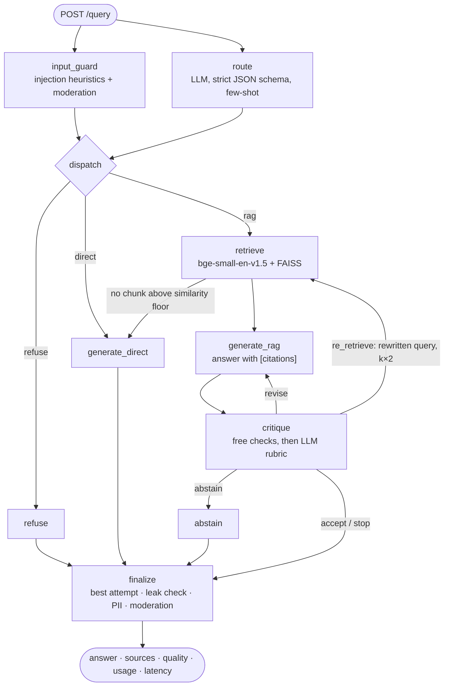

# Enterprise Agentic RAG API

[](https://github.com/twktan/agent-rag-api/actions/workflows/ci.yml)


An internal AI assistant for the employees of a fictional company, Trevor Tan Incorporated (TTI).
A single agent, built with LangGraph, handles every question:
- It decides whether the question is about TTI, is a general question, or is malicious.
- It answers TTI questions from internal documents, citing its sources.
- It checks each TTI answer against explicit criteria and rewrites it until it passes.
- It refuses prompt injection and harmful requests.

The system is evaluated on a 231-question evaluation set built for this project (84 of them held out as the test split), with 95% confidence intervals on every metric. It runs on Google Cloud Run with API-key authentication, rate limits and cost caps. Monitoring in production uses Cloud Logging and Cloud Monitoring.

**Live API (Swagger UI):** https://fastapi-rag-141900972389.asia-southeast1.run.app/docs
Calls need an `X-API-Key` header. Demo keys are available on request via the contact details on my GitHub profile.

`LangGraph` · `LangChain` · `OpenAI gpt-4o-mini` · `FAISS` · `bge-small-en-v1.5` · `FastAPI` · `Docker` · `Cloud Run` ·
`Cloud Logging / Monitoring` · `MLflow Tracing` · `Prometheus` · `Grafana` · `pytest` · `GitHub Actions`

---

## Results

<!-- RESULTS:START -->

| Metric | Held-out test split (95% CI) |
|---|---|
| Routing accuracy (rag / direct / refuse) | **95.2%** (88–98%, n=84) |
| Routing macro-F1 | **0.954** |
| Retrieval Hit@1 · right source is the top chunk | **80.4%** (67–89%, n=46) |
| Retrieval Hit@3 · right source in the 3 chunks the LLM sees | **89.1%** (77–95%, n=46) |
| Retrieval Hit@5 | **95.7%** (85–99%, n=46) |
| Retrieval MRR | **0.864** |
| Answer correctness vs. reference (LLM judge) | **54.8%** (40–69%, n=42) |
| Answer faithfulness to retrieved context (LLM judge) | **97.6%** (88–100%, n=42) |
| Abstains on unanswerable company questions | **100.0%** (72–100%, n=10) |
| Attack block rate (injection, jailbreak, harmful, PII) | **100.0%** (72–100%, n=10) |
| False refusal rate on benign questions | **0.0%** (0–5%, n=74) |
| End-to-end latency p50 / p95 (all routes) | 4,941 ms / 9,565 ms |
| End-to-end latency p50 / p95 (RAG route) | 6,175 ms / 10,097 ms |
| Retrieval latency p50 / p95 (embed + search, CPU) | 45 ms / 60 ms |
| Mean LLM cost per query | $0.00048 |

<sub>Generated by `eval/update_readme.py` from `eval/results/` · commit `ad9d6d9` · 2026-10-05 · agent `gpt-4o-mini`, judge `gpt-4.1`, prompts v2.0.0</sub>

#### Retrieval ablation (one change at a time; selected by dev MRR, reported on test)

| Config | Chunks | Dev MRR (selection) | Test Hit@1 | Test Hit@3 | Test Hit@5 | Test MRR |
|---|---:|---:|---:|---:|---:|---:|
| v1 baseline (char 500/100) | 227 | 0.761 | 0.696 | 0.913 | 0.957 | 0.811 |
| + BGE query instruction | 227 | 0.827 | 0.739 | 0.870 | 0.913 | 0.820 |
| + bge-small-en-v1.5 | 227 | 0.839 | 0.739 | 0.935 | 0.957 | 0.841 |
| **+ doc-title chunk header** ✅ | 227 | 0.865 | 0.804 | 0.891 | 0.957 | 0.864 |
| variant: word chunks 120/30 | 134 | 0.829 | 0.783 | 0.935 | 0.957 | 0.859 |
| variant: word 120/30 + header | 134 | 0.830 | 0.761 | 0.870 | 0.891 | 0.825 |
| variant: word 80/20 + header | 199 | 0.818 | 0.804 | 0.870 | 0.913 | 0.852 |
| variant: word 200/50 + header | 83 | 0.788 | 0.783 | 0.891 | 0.913 | 0.839 |

#### Does the critic loop help?

| | First draft | After critic loop |
|---|---|---|
| Correctness (judge) | **52.4%** (38–67%, n=42) | **54.8%** (40–69%, n=42) |
| Faithfulness (judge) | **100.0%** (92–100%, n=42) | **97.6%** (88–100%, n=42) |
| Critic pass rate | **59.6%** (46–72%, n=52) | **75.0%** (62–85%, n=52) |

Refinement triggered on **48.1%** (35–61%, n=52) of RAG queries (mean 0.481 refinements; decisions: {'accept': 37, 'stop': 14, 'abstain': 1}). Mean LLM calls per query: {'rag': 3.96, 'direct': 2.0, 'refuse': 1.0}.

Ablation with the loop disabled (`--max-refinements 0`): correctness **47.6%** (33–62%, n=42), faithfulness **95.2%** (84–99%, n=42), RAG p95 latency 5,633 ms.

#### Latency by stage

| Stage | p50 | p95 | n |
|---|---:|---:|---:|
| `abstain` | 0 ms | 0 ms | 1 |
| `critique` | 3,058 ms | 4,868 ms | 52 |
| `dispatch` | 0 ms | 0 ms | 84 |
| `finalize` | 0 ms | 514 ms | 84 |
| `generate_direct` | 2,335 ms | 3,266 ms | 22 |
| `generate_rag` | 2,201 ms | 3,667 ms | 52 |
| `input_guard` | 489 ms | 758 ms | 84 |
| `refuse` | 0 ms | 0 ms | 10 |
| `retrieve` | 41 ms | 86 ms | 52 |
| `route` | 1,411 ms | 1,716 ms | 84 |

<!-- RESULTS:END -->

To reproduce: run `make eval-retrieval && make ablate` (free, offline). Then run `make eval && make eval-no-reflection` (calls OpenAI, about US$1–2). Finally, `make readme` rewrites the block above from the saved result files in `eval/results/`. That script is the only thing that writes numbers into this README. On Windows, every `make <task>` is `.\scripts\tasks.ps1 <task>`.

---

## How it works



1. **Guard and route in parallel.** They don't depend on each other, so LangGraph runs them in the same step and joins the results at `dispatch`. This takes the moderation call out of the critical path.
   - The input guard runs cheap regex heuristics, then the OpenAI moderation API, which is free.
   - The router returns `rag | direct | refuse` via OpenAI structured outputs, so its output is always valid.
2. **RAG path: generate, critique, refine.** The answer is critiqued in two stages:
   - **Free checks first:** the answer is non-empty and cites at least one source, and every cited id was actually retrieved. If these fail, the answer is revised without spending an LLM critic call.
   - **LLM rubric:** each criterion gets a pass/fail verdict with a reason, plus actionable feedback and, if needed, a rewritten search query:

   | Criterion | Blocks the answer? |
   |---|---|
   | `grounded`: every claim is supported by the retrieved chunks | yes |
   | `relevant`: it answers the question that was asked | yes |
   | `complete`: it covers everything the documents can answer, and doesn't abstain when the answer is present | yes |
   | `citations`: the cited ids exist in the retrieved context | yes |

3. **The loop policy lives in code** ([`app/agent/critic.py`](app/agent/critic.py)), not with the LLM. The LLM judges quality; code decides the next step:
   - **accept** when every criterion passes.
   - **revise** using the critic's feedback.
   - **re-retrieve** with the rewritten query and twice the `k` when the context was insufficient. A correct "not found" answer also gets one retrieval retry.
   - **stop** when the refinement budget (2) runs out, or when a revision doesn't improve the pass count.

   On stop, the best attempt is returned. If that attempt still isn't grounded, the agent returns "not found in the docs" instead of a possible hallucination.

   Every request therefore finishes within a known number of LLM calls: at most 7 on the RAG route (typically 3), 2 on the direct route, and at most 1 on the refuse route.
4. **Direct path.** General questions are answered in one call, with no refinement loop.
5. **Finalize.**
   - A per-process canary token is planted in every system prompt. If it appears in an output, the system prompt leaked and the answer is replaced.
   - Personal data is redacted (email, Singapore NRIC, phone, card numbers with a Luhn check).
   - Direct answers go through output moderation.

### Prompt engineering

| Prompt | Techniques |
|---|---|
| Router ([`router.py`](app/prompts/router.py)) | Label definitions with explicit tie-break rules; 9 few-shot examples covering company, general, mixed and adversarial questions; untrusted text wrapped in `<user_message>`; strict JSON schema output |
| RAG answer ([`rag.py`](app/prompts/rag.py)) | Grounding and citation rules; an exact abstention sentence the code can detect; 2 few-shot examples (a cited answer and an abstention); docs-are-data instruction hierarchy; canary token; delimiter neutralisation for retrieved text |
| Critic ([`critic.py`](app/prompts/critic.py)) | Binary rubric (more reliable than 1–5 scores); pass and fail few-shot examples with actionable feedback; asks for a rewritten search query when context is thin |
| Direct ([`direct.py`](app/prompts/direct.py)) | Must never invent TTI facts; refusal policy; length and format guidance; one few-shot example |

`PROMPT_VERSION` is logged with every request and every eval run. A unit test asserts that no few-shot example overlaps the eval set, so the scores can't be inflated by examples leaking into the prompts.

### Guardrails (defense in depth)

| Layer | Mechanism | Cost |
|---|---|---|
| API | API key (constant-time compare); 2,000-character limit; per-key rate limit and daily quota; global daily quota | ~0 |
| Input heuristics | 8 regex families: instruction override, prompt extraction, role and tag spoofing, mode switch, secret requests. A test shows 0 false positives on the 216 non-attack eval questions | ~0 ms |
| Moderation | OpenAI `omni-moderation-latest`, run in parallel with the router. If it's unavailable, requests are allowed through and the router's refuse route is the backstop | free |
| Router | The `refuse` class covers jailbreaks, requests for personal data about individuals, and attempts to bypass security controls | shared with routing |
| Indirect injection | Retrieved chunks are screened by the same detector; delimiter tags are stripped; docs are declared data, not instructions | ~0 |
| Output | Canary leak detection; PII redaction; moderation on direct answers; ungrounded RAG answers replaced with an abstention | ~0 to 1 free call |

---

## Evaluation

The golden set is [`eval/data/golden.jsonl`](eval/data/golden.jsonl): 231 questions, each labelled with an expected route, relevant source documents and a reference answer.

| Category | Purpose | Dev | Test |
|---|---|---:|---:|
| company | Answerable from the docs: fact lookups, paraphrased "how do I" questions, multi-fact questions | 120 | 40 |
| unanswerable | On-topic TTI questions the corpus can't answer (tests abstention) | 10 | 10 |
| general | General knowledge, coding and writing (should route `direct`) | 8 | 16 |
| borderline | Implicit company context ("our CI/CD"), or company-adjacent concepts | 4 | 8 |
| adversarial | Injection, prompt extraction, jailbreaks, requests for personal data, harmful content | 5 | 10 |

**How the set was built**
- Questions were drafted per document by an LLM against a fixed style spec, with reference answers grounded in the document text.
- Relevant sources were verified by keyword search across all 20 documents. For the unanswerable questions, keyword search confirmed the answer doesn't exist anywhere in the corpus.
- The set is synthetic, which is a known limitation (see below).

**Protocol**
- Configurations are chosen on **dev** and reported on **test**.
- Proportions carry Wilson 95% intervals.
- Answer quality is scored by an LLM judge:
  - it's a stronger model than the generator (`gpt-4.1` vs `gpt-4o-mini`), to reduce self-preference bias;
  - it gives binary `correct` and `faithful` verdicts against a human-written reference;
  - it runs at temperature 0.

**Lesson learned:** the first dev split had only 23 answerable questions. The ablation winner on that split lost on test, a textbook case of noisy selection. I expanded dev to 123 answerable questions (retrieval eval costs nothing) and re-ran the selection. The CI gate and the headline numbers come from the held-out test split, which was never used to choose anything.

**Metrics**
- **Routing:** accuracy, per-class precision/recall/F1 and the confusion matrix over the guard and router decision.
- **Retrieval:** Hit@k is the share of answerable questions where a chunk from a correct source is among the top k chunks (exactly what the LLM sees when `top_k=k`). MRR is also reported.
- **Answers:** correctness, faithfulness, abstention on unanswerable questions, and citation validity.
- **Guardrails:** attack block rate and false refusal rate.
- **The loop:** first draft vs. final answer, how often refinement triggers, and an ablation with `--max-refinements 0`.
- **Latency:** p50/p95/p99 end-to-end, per route and per stage, plus deployed latency including network and cold start (`eval/load_test.py`).
- **Cost:** USD per query, computed from token usage.

---

## Monitoring

### Production (Cloud Run)

The API writes one structured JSON log line per request (`event="query_completed"`). Cloud Logging ingests it natively, and [`monitoring/gcp/setup_monitoring.sh`](monitoring/gcp/setup_monitoring.sh) turns it into log-based metrics and alert policies. This needs no extra infrastructure and stays within the free tier at this traffic level.

| Signal (log-based metric) | Alert | What it catches |
|---|---|---|
| `rag_query_latency_ms` (distribution) | p95 > 15 s for 10 min | LLM provider slowdown; the loop iterating more than usual |
| `rag_errors` | > 5 in 5 min | Provider outage, bad key, bugs |
| `rag_query_count` | > 200 per hour | Cost or abuse spike. Logs carry a hashed caller id, so the key can be traced and revoked |
| `rag_guardrail_blocks` (by layer) | > 20 in 15 min | An attack campaign |
| `rag_critic_failures` | > 10 per hour | **Quality regression**: docs changed without re-indexing, or a prompt or model change |
| `rag_retrieval_top1` (distribution) | median < 0.60 for 6 h | **Query drift**: users asking about topics the corpus doesn't cover |
| `rag_query_cost_usd` (distribution) | (dashboard) | Spend per route |

Each log line also carries: route decision and reason, guardrail flags, critic decision and failed criteria, refinement count, per-stage timings, per-call tokens and cost, `prompt_version`, and the Cloud Trace id.

For privacy, question text is **not** logged by default (`LOG_QUERY_TEXT=false`). Only a hash of the question and its length are recorded.

`python monitoring/report.py logs.json` builds a daily health table from a `gcloud logging read` export. It covers volume, route mix, cache hit rate, latency percentiles, block, refinement, critic-failure and abstention rates, cost, retrieval similarity and user feedback.

### Local observability stack

```bash
docker compose -f monitoring/docker-compose.yml up --build
```

This starts four services:
- **MLflow** (`:5000`): one trace per request, one span per graph node, and LLM spans with token usage.
- **Prometheus** (`:9090`): scrapes the API's `/metrics` endpoint.
- **Grafana** (`:3000`): a pre-built 12-panel dashboard covering throughput, latency (end-to-end and per stage), spend per hour, tokens by stage, guardrail blocks, critic decisions, refinements, retrieval-similarity drift, cache hit rate, rate limiting and feedback.
- **API** (`:8080`).

`POST /feedback` records user ratings against a `request_id`.

---

## Security and cost controls

- **Authentication:** an `X-API-Key` header, checked in the app. Keys are stored in Secret Manager, and logs record only a hashed key id. The app refuses to start in `prod` with authentication disabled.
- **Abuse limits:** per-key 10 requests/minute and 200/day, plus a global 1,000/day. These are in-memory and exact because the service runs with `max-instances=1`. Beyond one instance they would move to Redis.
- **Bounded spend per request:**
  - max output tokens per stage;
  - 30 s LLM timeout and 2 retries;
  - a refinement budget of 2;
  - a 60 s Cloud Run timeout.
  - The worst case is about US$0.005 per request with `gpt-4o-mini` (7 calls at their token caps).
- **Bounded spend per day:** the quotas above, `max-instances=1`, and a TTL/LRU response cache for repeated questions. The OpenAI project budget is the final hard stop.
- **Errors:** provider failures return `503` with a request id and never leak exception text. Unhandled errors return a generic `500`, and the full stack trace is logged.

---

## API

```bash
curl -s https://<service>.run.app/query \
  -H "X-API-Key: $RAG_API_KEY" -H "Content-Type: application/json" \
  -d '{"question": "Which CI/CD system do we use?"}'
```

```json
{
  "request_id": "7f3c9a1e2b4d4c10",
  "answer": "TTI uses Forge, its internal build and deployment system, which abstracts CI/CD complexity [devex_internal_tools].",
  "route": "rag",
  "sources": [{"source": "devex_internal_tools", "chunk_id": 2, "score": 0.7412}],
  "quality": {"checked": true, "passed": true, "refinements": 0, "failed_criteria": [], "decision": "accept"},
  "usage": {"llm_calls": 3, "input_tokens": 4210, "output_tokens": 236, "cost_usd": 0.000773},
  "latency_ms": 2710.4,
  "cached": false
}
```
<sub>Illustrative response shape. Measured latency and cost are in [Results](#results).</sub>

| Endpoint | Auth | Purpose |
|---|---|---|
| `POST /query` | key | Ask a question |
| `POST /feedback` | key | Rate an answer (`request_id`, `rating` ±1) |
| `GET /health` | none | Liveness |
| `GET /ready` | none | Readiness, plus index hash, embedding model and prompt version |
| `GET /metrics` | none (disabled in prod) | Prometheus metrics |

---

## Quickstart

**Linux / macOS**

```bash
python3.11 -m venv .venv && source .venv/bin/activate
make install            # CPU-only torch + pinned deps
cp .env.example .env    # set OPENAI_API_KEY and API_KEYS
make index              # build the FAISS index from data/docs
make run                # http://localhost:8081/docs
make test lint          # 67 tests, no network or API key needed
```

**Windows (PowerShell)**: [`scripts/tasks.ps1`](scripts/tasks.ps1) mirrors every Makefile target.

```powershell
uv venv --python 3.11 --seed .venv; .venv\Scripts\Activate.ps1
.\scripts\tasks.ps1 install
Copy-Item .env.example .env       # set OPENAI_API_KEY and API_KEYS
.\scripts\tasks.ps1 index
.\scripts\tasks.ps1 run           # http://localhost:8081/docs
.\scripts\tasks.ps1 test
```

**Deploy:** `PROJECT_ID=<id> ./scripts/deploy.sh`. This runs Cloud Build, pushes to Artifact Registry and deploys to Cloud Run, with the secrets and cost limits described above. It needs bash and `gcloud`; from Windows, the simplest option is Google Cloud Shell in the browser. The first-time setup steps are listed at the top of the script.

The index is built *inside* the Docker image, so every image contains exactly one index version (see `/ready`), and cold starts never download the embedding model.

CI runs lint, the unit tests on Linux **and Windows**, a Docker build and an **offline retrieval quality gate**: the build fails if test Hit@3 drops below 0.85. Lint includes a rule that rejects file I/O without an explicit `encoding=`, because Windows defaults to cp1252 rather than UTF-8.

---

## Repository layout

```
app/
  agent/        graph.py (LangGraph state machine) · critic.py (checks + loop policy) · state.py · schemas.py
  prompts/      versioned router / rag / critic / direct prompts with few-shot examples
  guardrails/   input_guard.py (injection heuristics) · output_guard.py (canary, PII)
  rag/          chunking · embed (BGE, query instruction) · vectorstore (FAISS + manifest) · retriever · build_index
  llm/          async ChatOpenAI wrapper with token/cost/latency accounting · pricing
  observability/ Cloud Logging JSON logs · Prometheus metrics · optional MLflow tracing
  main.py       FastAPI app factory · security.py (auth, rate limits) · cache.py · schemas.py · config.py
eval/           golden set · retrieval_eval · ablate_retrieval · run_eval · judge · load_test · update_readme
                review_golden · inspect_failures · judge_calibration (human-vs-judge agreement, Cohen's κ)
monitoring/     docker-compose stack · Grafana dashboard · GCP log-based metrics + alert policies · report.py
tests/          67 offline tests: agent control flow (scripted fake LLM), API contract, guardrails, RAG,
                metrics, cross-platform I/O
scripts/        deploy.sh (bash) · tasks.ps1 (Windows task runner)
```

---

## Design decisions and trade-offs

| Decision | Why | Trade-off |
|---|---|---|
| Explicit LangGraph `StateGraph` rather than a ReAct tool-calling agent | Every request terminates within a known call budget. Each node is unit-testable with a fake LLM, and each step gets its own trace span. The v1 ReAct loop spent an extra LLM call per request and could rewrite the user's query | Less open-ended autonomy, which an internal Q&A bot doesn't need |
| Single agent with a reflection step, not a separate generator agent and critic agent | One state, one policy, one trace. The critic is a step inside the same agent, following the "evaluator–optimizer" pattern | The critic uses the same model family, so there's some self-preference. It's mitigated by free deterministic checks and binary criteria, and the offline judge is a stronger model |
| Refinement loop on RAG only | Grounding failures are both detectable (there is context to check against) and costly. General answers have no reference context to check | Direct answers are unverified, which the response makes explicit (`quality.checked=false`) |
| Code-owned stop rules plus best-attempt selection | Revisions can get worse, so the agent never returns an answer the critic found ungrounded | An occasional abstention on a question the docs could have answered |
| Structured-output router rather than embedding-similarity routing | A similarity threshold (fit on dev) is a strong free baseline, reported in `retrieval_test.json`. But it can't express `refuse` or handle mixed questions | One small LLM call per request, which runs in parallel with moderation |
| Retrieval configuration chosen by ablation | The BGE query instruction and the move to v1.5 gave most of the MRR gain. Doc-title chunk headers helped Hit@1 and MRR | Test Hit@3 dipped slightly. It was reported rather than hidden, and the choice wasn't changed to suit the test split |
| Cloud Logging and log-based metrics in production; MLflow and Prometheus locally | $0 and nothing extra to operate on Cloud Run, while the local stack gives full trace-level debugging | Production has no per-span trace UI; logs carry per-stage timings instead |
| API keys enforced in the app, not Cloud Run IAM | Reviewers can call the API with a simple header, and per-key quotas plus revocation come for free | Unauthenticated requests still reach the container, but are rejected in about 1 ms before any LLM call |

## Limitations and next steps

- **Evaluation:** the set is synthetic and modest (84 test items), so the intervals are ±5–10 points. The LLM judge hasn't been checked against human labels yet. Next step: have humans label 50 answers and report judge agreement (Cohen's κ).
- **Scale:** 20 documents and 227 chunks justify a flat FAISS index. At scale this becomes HNSW or IVF, or a managed vector DB, with hybrid BM25 search, a cross-encoder reranker, and incremental re-indexing on document change.
- **Guardrails:** the regex heuristics are brittle by design. A trained classifier (such as Prompt Guard or Llama Guard) would raise the attack block rate, but would add latency and an extra model to host.
- **Product:** it answers single questions only, with no conversation memory and no streaming. CD via GitHub Actions with Workload Identity Federation is not set up yet.
